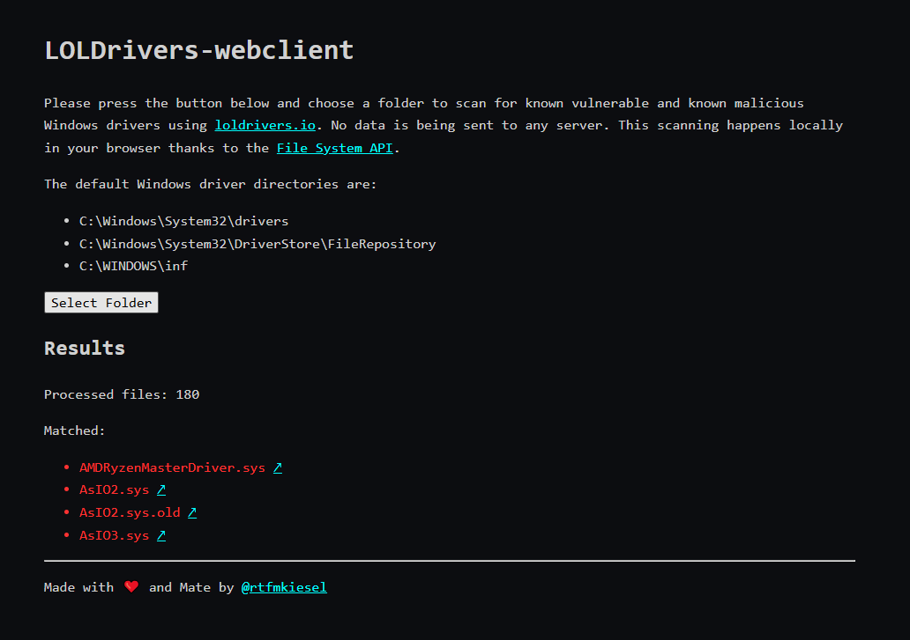

# LOLDrivers-webclient

A PoC web client for [LOLDrivers](https://github.com/magicsword-io/LOLDrivers) (Living Off The Land Drivers) by [MagicSword](https://www.magicsword.io/). Scan your computer for known vulnerable and known malicious Windows drivers.



*This was hacked together in like 2,5 hours, please have mercy*

## Usage
Click [here](https://rtfmkiesel.github.io/loldrivers-webclient), wait a few seconds, and then select the directory to scan. The default Windows driver directories are:
+ C:\Windows\System32\drivers
+ C:\Windows\System32\DriverStore\FileRepository
+ C:\WINDOWS\inf

## Build
To build `loldrivers-webclient.wasm` yourself:
```sh
GOOS=js GOARCH=wasm go build -o .\assets\loldrivers-webclient.wasm
```
